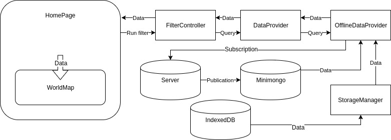

# Overview
## Technologies stack
Black Book Application use these technoligies:
1. [Meteor](https://www.meteor.com/)
2. [Angular](https://angular.io/)
3. [Ionicfarmework](http://ionicframework.com/)

This technology stack allows us open it as a web application and as an Ipad app.
## General interaction scheme of the app
The app is split into to 2 parts, client and server, they communicate through [DDP](https://en.wikipedia.org/wiki/Distributed_Data_Protocol).

## General functionality overview by page
1. Home - this page contains a world map with business data, filters for that data and a table that agregates data about particular business unit. Those are main instruments which a user works with.
2. Settings - this page contains several sections.
   * Preferences - here a user can configure how the data will be displayed on the map and also load business data into the application.
   * Profile settings - here a user can change password.
   * User list - this section is only for the administrator so that he can add, delete and edit members/users.
3. Sign in - The name speaks for itself, page for entering the system.
# Client
Now we will go through all the pages and investigate how our application works on a level of angular components and services. We will only consider main elements and ignore less important ones.
## Home page
Three main entities can be outlined: map, filter and tables.
Home page is presented though a HomePage component.
### Map
The entity of the map is represented in angular component WorldMap. It uses library d3 in order to render a map and business units in SVG. WorldMap receives data that needs to be render from a parent component HomePage through HTML attribute “data-to-render”. HomePage in its turn receives that data from the DataProvider service.
DataProvider is responsible for providing data from the server by mogoDB request. Here is what it looks like schematically.

### Filter
Filter is presented with 3 components and one service - MainFilter, BuFilter, CtegoryFilter and FilterController. All of these parts work together in order to form mongodb request and pass it to its service DataProvider that returns data into HomePage.

### Tables
Tables represented by two components Overview and Factsheet and one service SheetsController.
1. Overview - By clicking any of the BU on the map of WorldMap component the signal is sent to HomePage and passes it a BU object. HomePage in its turn makes a request to SheetsController, that creates an Overview of the component. Overview of the components receives new service object DataProvider when being created.

2. Factsheet - On click of “factsheet” of a component Overview closes and SheetController creates a component Factsheet that also receives a new object DataProvider and all the data that it requires from it. Schematically it looks as follows:

## Settings page
This page is presented by PreferencesPage component. This component uses Ionic Tabs to show three sections: Preferences, Profile, Settings and User list.

### Preferences
This section is represented by SwitchersPage, that in its turn contains component MapSwitchers. This component contains a set of triggers, that adjusts the showing of BU on WorldMap and SwitchersPage interact through their parent components. They (parent components) in their turn pass an object with settings from one to another through LocalStorage. This allows not to reset settings when finishing working with the application.

Also SwitchersPage contains buttons for uploading coordinates and business data to the server.Loading is carried out with the help of PickFile component and service DataUploader.

### Profile settings
This section represents ProfileSettingsPage component and ProfileSettings service. This component contains form where a user can enter his/her new password. Data from a form comes to ProfileSettings service and  through Meteor
 ProfileSettings passes the data to the server where password chnges.
### Users list
This section is only available to the administrator. Main part of it are components UserManagementPage, CreateUserPage, EditUserPage and services UsersController and PopoverController. UserManagementPage received a list from UsersController and renders them in a list. You can select a user from the list and call 2 actions upon it, edit or delete. Also you can add a new user. When editing PopoverController opens a new modal window which contains a EditUserPage component. In order to change data EditUserPage calls UsersController service which in its turn connects to the server (through meteor methods) where the the user data is changed. The modal window also opens when creating a new user, but with a CreateUserPage component, that uses UsersController as well. Deletion of a user is too carried out through UsersController

# Server
In the previos section we looked at how our app works on the client, now it is time to have a look at what goes on in the server.We will be following the same order as in “Client” paragraph.
## Home page
As you may have noticed all the data that we use on HomePage, we take from DataProvider service. In order for DataProvider to be able to receive that data there is a collection with BusinessData data on the server that provides access to client through subscription to the data from our collection. Publication “businessData” receives parameters mongoQuery object, choses data that match what is in mongoQuery object and returns this data with DDP method.
## Settings page
### Preferences
Since settings of the map are not saved on the server, lets go on to the upload process. We have 2 methods  “data.upload” and “data.uploadCoordinates”. Method “data.upload” receives file data from the client and starts paralel process. In this process data is calculated and added to BusinessData collection. Then a paralel process ends and the work continues in the  “data.upload” method. Some additional data is generated and entered into related collections.

Now lets move on to “data.uploadCoordinates” method which is even easier. The method receives data from file and simply writes them into the collection GeoCoordinates. here is what it looks like:

### Profile settings
Here we use standard meteor metheod Accounts.cahngePassword
### Users list
We have 3 methods for work with users ‘users.create’, ‘users.update’ and ‘users.remove’ all of them are accessible only to administrator and use a standard collection Meteor.users. In order for administrator to be able to view collection of users on the client we publish that data through “users” publication. “users” publication receives paramenters limit and count. These 2 parameters are for pagination.
